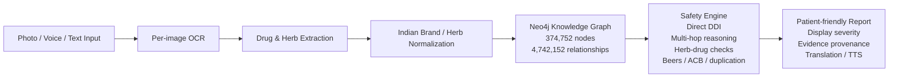

<h1 align="center">
  
  Sahayak
</h1>

<p align="center"><strong>We built Sahayak as a graph-first, AI-enhanced medication safety assistant for Indian elderly patients.</strong></p>

<p align="center">
  It reads medicine photos, resolves Indian brand names and Ayurvedic herbs,
  detects direct and hidden interactions, and explains risk in simple language a patient or caregiver can actually use.
</p>

<p align="center">
  <a href="https://drive.google.com/file/d/1flDrBc4azwtw6EeM76nGWD4jQp2GkK5x/view?usp=drivesdk">Watch 2-Min Demo</a>
  ·
  <a href="https://drive.google.com/file/d/1gquj4NYOrq74wG2DNj3Sqbq6spR4T5Ta/view?usp=drive_link">Download Android APK</a>
  ·
  <a href="./docs/SAHAYAK_COMPLETE_EXPLAINER.md">Full Technical Explainer</a>
  ·
  <a href="#what-we-built">What We Built</a>
  ·
  <a href="#run-locally">Run Locally</a>
</p>

## What We Built

We built Sahayak around a problem we think most generic medication checkers do not solve well in the Indian context:

- elderly patients often take 5-10 medicines from different doctors
- medicine inputs are usually Indian brand names, not canonical generics
- many people also take Ayurvedic herbs that standard systems ignore
- dangerous interactions are often indirect, not just drug A versus drug B
- explanations need to be understandable by patients and caregivers, not only clinicians

So we designed the system to cover the full chain end to end:

- per-image OCR for prescriptions and medicine strips
- Indian brand and herb resolution into canonical medicines
- graph-backed direct and multi-hop safety analysis
- elderly-specific Beers screening and anticholinergic burden checks
- multilingual, patient-friendly report generation with preserved evidence provenance

A quick example of the kind of case we wanted this to handle:

`Ecosprin 75 + Warf 5 + Garlic`

Sahayak resolves the Indian brand to `aspirin`, detects the blood-thinner interaction with `warfarin`, adds the herb risk from `garlic`, and turns that into an actionable warning instead of raw graph output.

## Why We Built It This Way

| Challenge | Why it matters |
|---|---|
| Indian brand-name prescriptions | Real-world input is `Ecosprin`, `Dolo 650`, `Thyronorm`, not just `aspirin` or `paracetamol` |
| Herb-drug interaction coverage | Elderly patients often combine allopathic medicines with Ayurvedic supplements |
| Hidden mechanism interactions | Serious risks can flow through CYP enzymes, transporters, QT, electrolytes, or CNS compounding |
| Elderly-specific safety | Pairwise DDI checking alone misses Beers risks, burden scoring, and duplication issues |
| Trustworthy reporting | A patient-facing system cannot hallucinate or lose evidence provenance during report generation |

## What We Implemented

| Capability | What we implemented |
|---|---|
| Indian medicine understanding | Maps 249K+ Indian brand entries to underlying generics and ingredients |
| Herb awareness | Checks curated Ayurvedic herb-drug interactions and regional herb names |
| Multi-hop reasoning | Detects hidden risks via CYP inhibition/induction, transporters, QT, electrolytes, and CNS compounding |
| Elderly-first safety | Applies Beers Criteria, anticholinergic burden scoring, and therapeutic duplication checks |
| Provenance-aware reports | Preserves finding identity, evidence provenance, citations, and display severity |
| Honest uncertainty | Unresolved direct-DDI severity is surfaced to patients as `Doctor Review`, not raw `UNKNOWN` |

## Validation Snapshot

| Metric | Result |
|---|---:|
| Critical sentinel interactions validated | 50 / 50 |
| Real-world graph validation checks passed | 32 / 32 |
| Direct DDI sensitivity | 1.00 |
| Herb-drug sensitivity on curated set | 1.00 |
| Multi-hop graph path precision | 1.00 |
| Hallucinated findings in grounded evaluation | 0.00 |
| Backend P95 latency | 1338.51 ms |
| Live graph size | 374,752 nodes / 4,742,152 relationships / 37 types |
| Report provenance regression suite | 16 / 16 passed |

These numbers are explained in full in [SAHAYAK_COMPLETE_EXPLAINER.md](./docs/SAHAYAK_COMPLETE_EXPLAINER.md).

## End-to-End Architecture



## What The User Flow Looks Like

1. The user selects a language and uploads medicine images.
2. Sahayak runs OCR per image instead of flattening everything into one text blob.
3. Extracted medicines are normalized from Indian brands into canonical drugs and ingredients.
4. Failed or suspicious predictions go into one manual review queue instead of being silently dropped.
5. The backend runs direct DDI, multi-hop, herb-drug, Beers, ACB, and duplication checks.
6. The report is generated in patient-friendly language with evidence kept attached to the correct finding.

## Modern Stack

| Layer | Stack |
|---|---|
| Mobile app | Expo 54, React Native 0.81, React 19, Expo Router, NativeWind, Zustand |
| Web frontend | Next.js 16.2, React 19.2, Tailwind CSS 4, Base UI |
| Backend | FastAPI, Pydantic 2, LangGraph, LangChain, Neo4j 5 |
| AI services | GPT-4o Vision, Gemini 2.0 Flash, Groq Llama Vision/Text, Sarvam AI, RxNorm API |
| Data backbone | DDInter, DDID, PrimeKG, Hetionet, SIDER, OnSIDES, TwoSIDES, Indian medicine dataset, FDA NDC, curated herbs, Beers 2023, CYP expansion |
| Deployment | Docker Compose local stack, RunPod-ready backend path |

## Why We Focused So Much On The Backend

We did not want this to be just a nice-looking mobile demo.

- the local Docker stack now serves the full graph, not a reduced showcase subset
- OCR, extraction, normalization, graph reasoning, and report generation are all connected in one working pipeline
- report generation is constrained by graph-backed findings rather than free-form model output
- the live pipeline preserves finding identity, citations, evidence profile, and patient-facing display severity

That backend depth is what makes the mobile experience credible.

## Demo And APK

- Demo video: [2-minute app demo](https://drive.google.com/file/d/1flDrBc4azwtw6EeM76nGWD4jQp2GkK5x/view?usp=drivesdk)
- Android APK: [Drive link](https://drive.google.com/file/d/1gquj4NYOrq74wG2DNj3Sqbq6spR4T5Ta/view?usp=drive_link)
- Full technical explainer: [SAHAYAK_COMPLETE_EXPLAINER.md](./docs/SAHAYAK_COMPLETE_EXPLAINER.md)

## Run Locally

<details>
<summary>Docker quickstart</summary>

```bash
cd sahayak
cp .env.example .env
# Fill in required API keys and Neo4j password

docker compose up --build -d
curl http://localhost:8000/healthz
```

Expected health shape:

```json
{"status":"ok","service":"SAHAYAK","neo4j":true,"graph_nodes":374752}
```

Neo4j Browser:

```bash
open http://localhost:7474
```

</details>

<details>
<summary>Developer notes</summary>

- The backend API lives in [`app/api/server.py`](./app/api/server.py).
- OCR logic lives in [`app/services/ocr_service.py`](./app/services/ocr_service.py).
- Drug normalization lives in [`app/services/drug_normalizer.py`](./app/services/drug_normalizer.py).
- The main safety engine lives in [`app/services/agentic_safety_checker.py`](./app/services/agentic_safety_checker.py).
- Report generation lives in [`app/services/report_generator.py`](./app/services/report_generator.py).
- The full graph query layer lives in [`app/graph/query_engine.py`](./app/graph/query_engine.py).
- Evaluation and regression tests live under [`tests`](./tests).

</details>

<details>
<summary>Repository map</summary>

```text
sahayak/
├── app/                              # FastAPI app, graph logic, services, data
├── mobile/                           # Expo / React Native mobile experience
├── frontend/                         # Next.js web frontend
├── tests/                            # Regression and evaluation tests
├── scripts/                          # Build, evaluation, repair, and smoke-test scripts
├── docker-compose.yml                # Local full-stack orchestration
├── docs/                             # Deep technical notes and evaluation docs
└── README.md                         # Project overview, proof, and quick start
```

</details>

## If You Want The Full Technical Story

We documented the full story behind the system design, graph construction, evaluation methodology, and honest limitations in [SAHAYAK_COMPLETE_EXPLAINER.md](./docs/SAHAYAK_COMPLETE_EXPLAINER.md).

It covers:

- the 12 data layers behind the graph
- the full medication-to-report pipeline
- how multi-hop interaction reasoning works
- where LLMs are used and where they are deliberately constrained
- what the evaluation results do and do not prove
